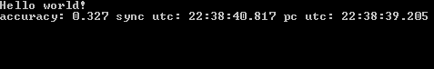

## xtime
Простая C++ библиотека  для работы с меткой времени (*timestamp*) и "понятной датой" (*human readable date*)

### Описание

Данная библиотека позволяет удобно и быстро работать с меткой времени (*timestamp*) и "понятной датой" (*human readable date*). Например: 

* Можно получить синхронизированное с интернетом время
* Можно легко преобразовать дату в timestamp или сделать обратную операцию 
* Можно легко получить реальное GMT время компьютера
* Можно преобразовать GMT в CET и обратно
* Получить день недели, количество дней в месяце, день года, день с начала UNIX времени и т.д.

Смотрите файл *xtime.hpp*, он содежрит подробные комментарии перед каждой функцией.
Для хранения и преобразования меток времени используется тип данных *uint64*, поэтому у данной библиотеки нет [проблемы 2038 года](https://en.wikipedia.org/wiki/Year_2038_problem)

Синхронизированное время реализовано в файле *xtime_sync.hpp* и для его работы вам понадобится *curl* с поддержкой *https*. Пример есть в папке *code_blocks*. Для сокращения времени запуска примера советую использовать готовые сборки *curl*, например: [https://github.com/NewYaroslav/curl-7.60.0-win64-mingw](https://github.com/NewYaroslav/curl-7.60.0-win64-mingw). Время синхронизируется при помощи [https://time.is/](https://time.is/), Time.is отображает точное, официальное атомное время в любом часовом поясе.

### Как установить?
Просто добавьте файлы *xtime.hpp* и *xtime.cpp* в свой проект или соберите библиотеку. Готовый файл *libxtime.a* есть в папке *lib*

### Функции и методы

Методы класса DateTime

* set_beg_day()
* set_end_day()
* set_beg_month()
* set_end_month()
* timestamp_t get_timestamp()
* set_timestamp(const timestamp_t timestamp)
* print()
* std::string get_str_date_time()
* std::string get_str_date_time_ms()
* std::string get_str_date()
* std::string get_str_time()
* int get_weekday()
* is_leap_year()
* int get_num_days_current_month()

Получение времени компьютера
* int get_milliseconds()
* timestamp_t get_timestamp()
* timestamp_ms_t get_timestamp_ms()

Преобразование времени в строку или вывод на экран

* std::string get_str_date_time(const timestamp_t timestamp)
* std::string get_str_date_time_ms(const timestamp_ms_t timestamp)
* std::string get_str_date(const timestamp_t timestamp)
* std::string get_str_time(const timestamp_t timestamp)
* std::string get_str_time_ms(const timestamp_ms_t timestamp)
* std::string get_str_date_time()
* std::string get_str_date_time_ms()
* print_date_time(const timestamp_t timestamp)

Данные функции выводят время и дату в следующих форматах:
* DD.MM.YYYY HH:MM:SS
* DD.MM.YYYY
* HH:MM:SS
* DD.MM.YYYY HH:MM:SS.fff
* HH:MM:SS.fff

Преобразование строки в метку времени

* bool convert_iso(const std::string str_iso_formatted_utc_datetime, DateTime& t)
* bool convert_str_to_timestamp(std::string str, timestamp_t& t)

Функция *convert_str_to_timestamp* подерживает следующий список разделителей чисел: */\_:-., *
Данная функия способна распрасить время и дату, принимаемых в следующем порядке и размерности:
* HH MM SS DD MM YY Пример: 20:25:00, 29 Aug 19 или 00:59:59 30.08.19
* HH MM SS DD MM YYYYY Пример: 00:59:59 30.08.2019 или 20:25:00, 29 Aug 2019
* DD MM YYYYY HH MM SS Пример: 25.02.2013 18:25:10
* YYYYY MM DD HH MM SS Пример: 2013.02.25 18:25:10
* YYYY.MM.DD Пример: 2013.02.25
* DD.MM.YYYY Пример: 21.09.2018
	 
Перевод времени из одной вреемнной зоны в другую

* timestamp_t convert_gmt_to_cet(const timestamp_t gmt)
* timestamp_t convert_gmt_to_eet(const timestamp_t gmt)
* timestamp_t convert_gmt_to_msk(const timestamp_t gmt)
* timestamp_t convert_cet_to_gmt(const timestamp_t cet)
* timestamp_t convert_eet_to_gmt(const timestamp_t eet)
* timestamp_t convert_msk_to_gmt(const timestamp_t msk)

Проверки различных условий

* bool is_beg_half_hour(const timestamp_t timestamp)
* bool is_beg_hour(const timestamp_t timestamp)
* bool is_beg_day(const timestamp_t timestamp)
* bool is_beg_week(const timestamp_t timestamp)
* bool is_beg_month(timestamp_t timestamp)
* bool is_end_month(const timestamp_t timestamp)
* bool is_correct_date(const int day, const int month, const int year)
* bool is_correct_time(const int hour, const int minutes = 0, const int seconds = 0)
* bool is_correct_date_time(const int day,const int month,const int year,const int hour = 0,const int minutes = 0,const int seconds = 0)
* bool is_day_off(const timestamp_t timestamp)
* bool is_day_off_for_day(const int day)
* bool is_leap_year(const int year)

Различные преобразования и вычисления

* int get_num_days_month(const int month, const int year)
* int get_num_days_month(const timestamp_t timestamp)
* timestamp_t get_first_timestamp_day(const timestamp_t timestamp)
* timestamp_t get_last_timestamp_day(const timestamp_t timestamp)
* timestamp_t get_first_timestamp_hour(const timestamp_t timestamp)
* timestamp_t get_first_timestamp_minute(const timestamp_t timestamp)
* int get_weekday(const int day, const int month, const int year)
* int get_weekday(const timestamp_t timestamp)
* int get_minute_day(const timestamp_t timestamp)
* int get_hour_day(const timestamp_t timestamp)
* int get_second_day(const timestamp_t timestamp)
* int get_day(const timestamp_t timestamp)
* timestamp_t get_timestamp_beg_year(const int year)
* int get_year(const timestamp_t timestamp)
* int get_day_year(const timestamp_t timestamp)
* int get_month_year(const timestamp_t timestamp)
* int get_day_in_year(const timestamp_t timestamp)
* int get_month_year(const timestamp_t timestamp)
* int get_month_day(const timestamp_t timestamp)
* timestamp_t get_last_timestamp_month(const timestamp_t timestamp)
* timestamp_t get_last_timestamp_sunday_month(const timestamp_t timestamp)

### Быстрый обзор

+ Получить синхронизированное *UTC* время

```C++
#include <iostream>
#include <xtime_sync.hpp>

int main() {
    std::cout << "Hello world!" << std::endl;
    xtime::TimeSync iTimeSync;
    while(!iTimeSync.is_time_sync()) {
        std::chrono::seconds sec(1);
        std::this_thread::sleep_for(sec);
    };

    double last_utc = iTimeSync.get_timestamp_ms();
    while(true) {
        double real_utc = iTimeSync.get_timestamp_ms();
        double pc_utc = xtime::get_timestamp_ms();
        if(real_utc - last_utc > 0.1) {
            std::cout << "accuracy: " << iTimeSync.get_accuracy() << " sync utc: " << xtime::get_str_time_ms(real_utc) << " pc utc: " << xtime::get_str_time_ms(pc_utc) << "\r";
            last_utc = real_utc;
        }
    };
    return 0;
}
```

На экране увидим:



+ Получить Unix-время из даты и стандартного времени
```C++
using namespace xtime;
// дата 24.05.2018 время 23:59:59
xtime::timestamp_t epoch = get_timestamp(24, 5, 2018, 23, 59, 59);
```
+ Класс для хранения времени
```C++
using namespace xtime;

// Инициализируем датой 24.05.2018
DateTime iTime(24,5,2018);

// Второй вариант инициализации с указанием времени
iTime = DateTime(24,5,2018, 0, 0, 0);
// iTime = DateTime(24,5,2018);

// Третий вариант инициализации (Инициализация с указанием unix-времени в формате ISO)
// iTime = DateTime("2013-12-06T15:23:01+00:00");

// Или инициализируем Unix epoch или Unix time или POSIX time или Unix timestamp
unsigned long long unix_epoch = 1527120000;

iTime.set_timestamp(unix_epoch);

// Переменные класса DateTime
iTime.day = 24; // день
iTime.month = 5; // месяц
iTime.year = 2018 // год
iTime.hour = 0; // час
iTime.minutes = 0; // минуты
iTime.seconds = 0; // секунды

// Получить Unix epoch или Unix time или POSIX time или Unix timestamp 
unix_epoch = iTime.get_timestamp();

// Вывести время и дату на экран
iTime.print();

// Получить дату и время в виде строки
std::string str = iTime.get_str_date_time(); // В строке будет 24.05.2018 00:00:00
```
+ Получить стандартное время
```C++
using namespace xtime;

xtime::timestamp_t unix_epoch = 1527120000;
DateTime iTime = convert_timestamp_to_datetime(unix_epoch);
```
+ Получить день недели
```C++
using namespace xtime;

// Получить номер дня недели
int wday = get_weekday(24,5,2018);

if(wday == SUN) std::cout << "SUN" << std::endl; // Если функция вернула 0 или Воскресенье
else if(wday == MON) std::cout << "MON" << std::endl; // Если функция вернула 1 или Понедельник
else if(wday == TUS) std::cout << "TUS" << std::endl;
else if(wday == WED) std::cout << "WED" << std::endl;
else if(wday == FRI) std::cout << "FRI" << std::endl;
else if(wday == SAT) std::cout << "SAT" << std::endl;

xtime::timestamp_t unix_epoch = 1527120000;

// Второй вариант функции для определения дня недели
wday = get_weekday(unix_epoch);

// Получить день недели через функцию класса DateTime
DateTime iTime(24,5,2018);
wday = iTime.get_weekday();
```
+ Конвертировать строку в формате ISO в данные класса DateTime
```C++
using namespace xtime;

DateTime iTime;
std::string strISOformattedUTCdatetime = "2013-12-06T15:23:01+00:00";
if(convert_iso(strISOformattedUTCdatetime, iTime) == true) {
  iTime.print();
}
```
+ Перевод времени CET во время GMT и обратно с учетом перехода на зимнее время
```C++
using namespace xtime;
// получаем время GMT для примера
DateTime startTime(20,3,2018);

xtime::timestamp_t startGMT = startTime.get_timestamp();
// переводим время GMT во время CET
DateTime realCET(convert_gmt_to_cet(startGMT));
realCET.print();
// переводим время CET во время GMT
DateTime realGMT(convert_cet_to_gmt(realCET.get_timestamp()));
realGMT.print();
```
+ Получить Unix-время компьютера
```C++
using namespace xtime;

unsigned long long t = get_timestamp();
std::string str = get_str_date_time(); // В строке время будет предсталвено как в примере (24.05.2018 00:00:00)
```
+ Получить количество дней в месяце и день года
```C++
using namespace xtime;

int month = 2;
int year = 2018;
std::cout << get_num_days_month(month, year) << std::endl;

DateTime iTime(20,3,2018);

// Получить количество дней в текущем (март) месяце
std::cout << iTime.get_num_days_current_month() << std::endl;
// Получить день года
std::cout << get_day_year(iTime.get_timestamp()) << std::endl;
```
+ Проверка високосного года
```C++
using namespace xtime;

int year = 2018;
if(is_leap_year(year)) {
	// если год високосный, то условие сработает
}

DateTime iTime(20,3,2018);

if(iTime.is_leap_year()) {
	// если год високосный, то условие сработает
}
```
+ Получение временной метки начала дня
```C++
using namespace xtime;

unsigned long long t = get_timestamp();
t = get_start_day(t);

```


